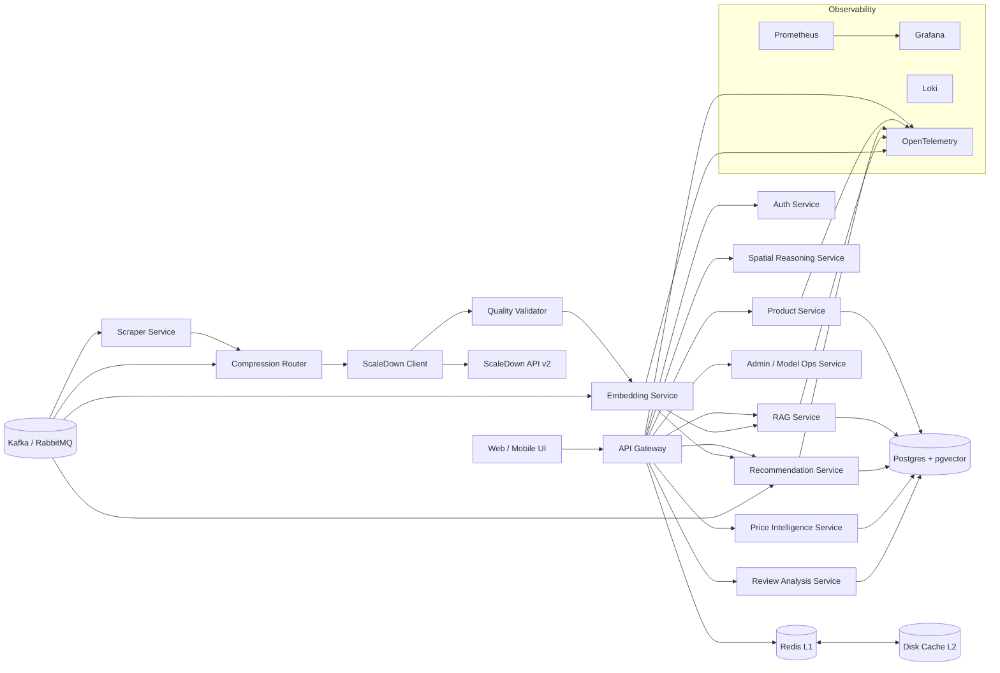

## System Architecture

ASCII diagram:

+--------------------+       +-------------------+       +-------------------+
|  Web / Mobile UI   | ----> |   API Gateway     | ----> |   Auth Service    |
+--------------------+       +-------------------+       +-------------------+
          |                              |                          |
          |                              v                          v
          |                      +---------------+          +---------------+
          |                      | Product Svc   |          | Admin / MLOps |
          |                      +---------------+          +---------------+
          |                              |                          |
          |                              v                          v
          |                      +---------------+          +---------------+
          |                      | RAG Service   |          | Review Analysis|
          |                      +---------------+          +---------------+
          |                              |                          |
          |                              v                          v
          |                      +---------------+          +---------------+
          |                      | Reco Service  |          | Price Intel   |
          |                      +---------------+          +---------------+
          |                              |                          |
          |                              v                          v
          |                      +---------------+          +---------------+
          |                      | Spatial Svc   |          | Embedding Svc |
          |                      +---------------+          +---------------+
          |                              |                          |
          |                              v                          v
          |                   +--------------------+     +------------------+
          |                   | Quality Validator  |     | Compression Router|
          |                   +--------------------+     +------------------+
          |                              |                          |
          |                              v                          v
          |                   +--------------------+     +------------------+
          |                   | ScaleDown Client   |     | Scraper Service  |
          |                   +--------------------+     +------------------+
          |                              |
          |                              v
          |                   +--------------------+
          |                   | External ScaleDown |
          |                   | API (v2 batch)     |
          |                   +--------------------+
          |
          v
 +------------------+   +-------------------+   +-------------------+
 | Postgres+pgvector|<->| Redis (L1 cache)  |<->| Disk Cache (L2)    |
 +------------------+   +-------------------+   +-------------------+
          ^
          |
  +------------------+
  | Kafka / RabbitMQ |
  +------------------+

Observability: Prometheus + Grafana + Loki + OpenTelemetry
CI/CD: GitHub Actions, Containers: Docker, Orchestration: Kubernetes (HPA)

Mermaid diagram:

